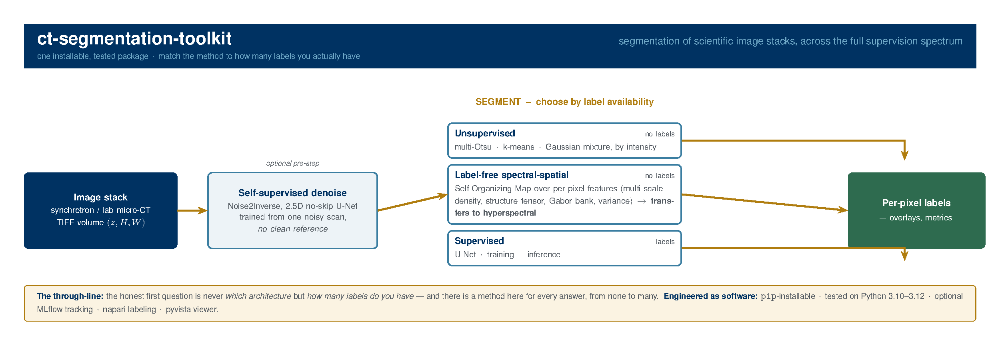

# ct-segmentation-toolkit

[](https://github.com/crentb/ct-segmentation-toolkit/actions/workflows/ci.yml)
[](LICENSE)
[](pyproject.toml)



Full schematic as a PDF: [docs/ct_segmentation_pipeline.pdf](docs/ct_segmentation_pipeline.pdf)

Segmentation of scientific image stacks (e.g., synchrotron CT) across the full
supervision spectrum, in one installable, tested package:

- **Supervised** — a U-Net (`ct_seg.model.UNetSegmentation`) with training + inference.
- **Unsupervised** — multi-Otsu, k-means, and GMM segmentation by intensity, with no
  training data needed.
- **Label-free spectral-spatial** — a Self-Organizing-Map segmenter that describes each
  pixel by multi-scale density, structure-tensor orientation/coherence, a Gabor filter
  bank, and local variance, then clusters the SOM nodes. The same spectral-spatial
  feature engineering transfers directly to **hyperspectral** cubes.
- **Self-supervised denoising** — a 2.5D **Noise2Inverse** denoiser (`ct_seg.denoise`): a
  no-skip U-Net trained from one noisy reconstruction (no clean reference), with a Laplacian
  Contrast Loss and edge-aware model selection. The author's own implementation of the N2I
  framework (upstream credit in [ct_seg/denoise/ACKNOWLEDGMENTS.md](ct_seg/denoise/ACKNOWLEDGMENTS.md)).

## Install

```bash
git clone https://github.com/crentb/ct-segmentation-toolkit.git
cd ct-segmentation-toolkit
python -m pip install -e ".[dev]"          # core + dev tools (pytest, ruff, black, mypy)
python -m pip install -e ".[viz]"          # optional: napari labeling + pyvista viewer
python -m pip install -e ".[mlops]"        # optional: MLflow experiment tracking
python -m pip install -e ".[denoise]"      # optional: N2I training (albumentations, PyYAML)
```

## Python API

```python
import numpy as np
from ct_seg import segment_kmeans, som_segment, UNetSegmentation

volume = np.random.rand(16, 256, 256).astype("float32")   # (slices, H, W) in [0, 1]

# Unsupervised intensity segmentation (no labels)
labels, info = segment_kmeans(volume, num_classes=4)

# Label-free spectral-spatial segmentation of a single slice
band_map = som_segment(volume[0], n_clusters=4)

# Supervised U-Net
model = UNetSegmentation(in_channels=1, num_classes=4)
```

## Command line

```bash
# Unsupervised (otsu | kmeans | gmm)
python -m ct_seg.segment --input /path/to/tiffs --method kmeans --num_classes 4 --save_overlay

# Train a U-Net, then segment with it
python -m ct_seg.train   --images /path/to/tiffs --masks /path/to/masks --num_classes 4
python -m ct_seg.segment --input /path/to/tiffs --method unet --model SegOutput/best_model.pth --num_classes 4
```

(Interactive `ct_seg.labeling` (napari) and `ct_seg.viewer` (napari/pyvista) require the
`[viz]` extra.)

## Experiment tracking & profiling

Training integrates optional **MLflow** logging (run parameters, per-epoch loss/mIoU,
and the best checkpoint). Install the extra and it logs automatically; without MLflow,
tracking is a harmless no-op and training is unaffected:

```bash
pip install -e ".[mlops]"
python -m ct_seg.train --images ... --masks ... --num_classes 4   # logs to ./mlruns
mlflow ui                                                          # browse runs
```

A reproducible **performance profile** (forward / train-step latency, throughput, and
peak GPU memory) is in [docs/PERF.md](docs/PERF.md):

```bash
python scripts/profile_unet.py --device cuda --sizes 256 512
```

## Testing

```bash
pytest -m "not slow"      # fast suite (what CI runs)
pytest                    # everything
```

## Status

The supervised, unsupervised, SOM, and **Noise2Inverse denoising** paths are functional and
tested. The denoiser (`ct_seg.denoise`) is the author's own implementation of the N2I
framework (upstream credit in `ct_seg/denoise/ACKNOWLEDGMENTS.md`). Related published work on deep-learning
segmentation and self-supervised denoising of synchrotron CT is available as a preprint:
https://ssrn.com/abstract=6805001

## Acknowledgments

`ct_seg.denoise` implements the Noise2Inverse framework (Hendriksen, Pelt & Batenburg,
*IEEE Transactions on Computational Imaging*, 2020; https://github.com/ahendriksen/noise2inverse).
See [ct_seg/denoise/ACKNOWLEDGMENTS.md](ct_seg/denoise/ACKNOWLEDGMENTS.md).

## License

Apache-2.0 — see [LICENSE](LICENSE) and [NOTICE](NOTICE).
