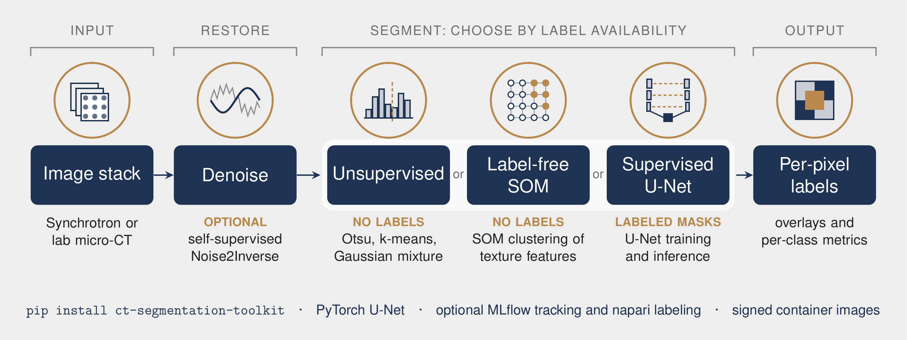

# ct-segmentation-toolkit

Segmentation of scientific image stacks across the full supervision spectrum, from no labels to fully labeled masks, in one tested Python package.

[](https://github.com/crentb/ct-segmentation-toolkit/actions/workflows/ci.yml)
[](https://pypi.org/project/ct-segmentation-toolkit/)
[](pyproject.toml)
[](https://doi.org/10.5281/zenodo.21148567)
[](LICENSE)



The toolkit segments volumetric images such as synchrotron and laboratory micro-computed tomography (micro-CT) stacks. It is organized around one practical question: how many labels exist? The unsupervised and label-free routes need none, and the U-Net needs annotated masks. An optional self-supervised denoiser raises the signal-to-noise ratio before any of them. Vector schematic: [docs/ct_segmentation_pipeline.pdf](docs/ct_segmentation_pipeline.pdf).

**Associated preprint:** C. Renteria *et al.*, "Deep learning segmentation of enamel rod architecture from synchrotron computed tomography for bioinspired material design," SSRN (2026), [doi:10.2139/ssrn.6805001](https://doi.org/10.2139/ssrn.6805001).

## Methods

| Route | Labels needed | Method | Entry point |
|---|---|---|---|
| Unsupervised | none | Multi-Otsu thresholding, k-means, or a Gaussian mixture model (GMM) on intensity | `segment_otsu`, `segment_kmeans`, `segment_gmm` |
| Label-free spectral-spatial | none | A Self-Organizing Map (SOM) over per-pixel features (multi-scale density, structure-tensor orientation and coherence, a Gabor filter bank, local variance), followed by clustering of the SOM nodes; the same features transfer to hyperspectral cubes | `som_segment` |
| Supervised | annotated masks | U-Net with training and inference | `UNetSegmentation`, `python -m ct_seg.train` |
| Denoising (optional) | none | 2.5D Noise2Inverse: a no-skip U-Net trained from one noisy reconstruction, with no clean reference, using a Laplacian Contrast Loss and edge-aware model selection | `ct_seg.denoise` |

The denoising subpackage was developed together by Austin Yunker (Argonne National Laboratory) and Cameron B. Renteria; upstream credit is in [ct_seg/denoise/ACKNOWLEDGMENTS.md](ct_seg/denoise/ACKNOWLEDGMENTS.md).

## Installation

From PyPI:

```bash
pip install ct-segmentation-toolkit                  # classical, SOM, and U-Net segmentation
pip install "ct-segmentation-toolkit[denoise]"       # + Noise2Inverse training (albumentations, PyYAML)
pip install "ct-segmentation-toolkit[viz]"           # + napari labeling and the PyVista viewer
pip install "ct-segmentation-toolkit[mlops]"         # + MLflow experiment tracking
```

As a signed container image:

```bash
docker pull ghcr.io/crentb/ct-segmentation-toolkit:v0.2.0
```

From source, for development:

```bash
git clone https://github.com/crentb/ct-segmentation-toolkit.git
cd ct-segmentation-toolkit
python -m pip install -e ".[dev]"       # core + pytest, ruff, black, mypy, pre-commit
```

## Quick start

Python API:

```python
import numpy as np
from ct_seg import segment_kmeans, som_segment, UNetSegmentation

volume = np.random.rand(16, 256, 256).astype("float32")   # (slices, H, W) in [0, 1]

# Unsupervised intensity segmentation (no labels)
labels, info = segment_kmeans(volume, num_classes=4)

# Label-free spectral-spatial segmentation of a single slice
band_map = som_segment(volume[0], n_clusters=4)

# Supervised U-Net
model = UNetSegmentation(in_channels=1, num_classes=4)
```

Command line:

```bash
# Unsupervised (otsu | kmeans | gmm)
python -m ct_seg.segment --input /path/to/tiffs --method kmeans --num_classes 4 --save_overlay

# Train a U-Net, then segment with it
python -m ct_seg.train   --images /path/to/tiffs --masks /path/to/masks --num_classes 4
python -m ct_seg.segment --input /path/to/tiffs --method unet --model SegOutput/best_model.pth --num_classes 4
```

The interactive tools `ct_seg.labeling` (napari) and `ct_seg.viewer` (napari and PyVista) require the `[viz]` extra.

## Experiment tracking and profiling

Training integrates optional **MLflow** logging of run parameters, per-epoch loss and mean intersection-over-union, and the best checkpoint. With the extra installed it logs automatically; without MLflow, tracking is a no-op and training is unaffected.

```bash
pip install "ct-segmentation-toolkit[mlops]"
python -m ct_seg.train --images ... --masks ... --num_classes 4   # logs to ./mlruns
mlflow ui                                                          # browse runs
```

A reproducible performance profile (forward and training-step latency, throughput, and peak GPU memory) is in [docs/PERF.md](docs/PERF.md):

```bash
python scripts/profile_unet.py --device cuda --sizes 256 512
```

## Repository layout

```text
ct_seg/
  segment.py      classical (Otsu, k-means, GMM) and U-Net segmentation; command line
  som_bands.py    spectral-spatial features and SOM segmentation
  model.py        U-Net model
  train.py        U-Net training command line, with optional MLflow logging
  tracking.py     optional MLflow experiment tracking (no-op when MLflow is absent)
  labeling.py     napari labeling tool                         [viz]
  viewer.py       napari / PyVista volume viewer               [viz]
  denoise/        2.5D Noise2Inverse: model, loss, training, inference, evaluation
docs/             overview figure (PNG, PDF, LaTeX source), performance profile, flame graphs
scripts/          profiling utilities
tests/            fast CPU test suite; slow tests are marked
```

## Testing and continuous integration

```bash
pytest -m "not slow"    # fast suite (what CI runs)
pytest                  # everything
```

Every push and pull request runs one gate, defined in [ci.yml](.github/workflows/ci.yml):

- **Quality:** ruff, black, mypy (advisory), and pytest with coverage on Python 3.10 to 3.14.
- **Security (blocking):** gitleaks secret detection over the full history, bandit static analysis at medium severity and above, and pip-audit against known vulnerabilities.
- **Container:** image build, a trivy scan that blocks on fixable critical and high findings, the test suite run inside the image, and an SPDX software bill of materials signed keylessly with cosign.

The same gate re-runs weekly on `main` ([scheduled-scan.yml](.github/workflows/scheduled-scan.yml)), so a newly published vulnerability surfaces without a code change. A version tag re-runs it on the tagged commit before [release.yml](.github/workflows/release.yml) publishes to PyPI through Trusted Publishing (no stored tokens) and pushes a scanned, cosign-signed image with SLSA build provenance to the GitHub Container Registry. To verify a published image:

```bash
cosign verify ghcr.io/crentb/ct-segmentation-toolkit:v0.2.0 \
  --certificate-identity-regexp 'github.com/crentb/' \
  --certificate-oidc-issuer https://token.actions.githubusercontent.com
gh attestation verify oci://ghcr.io/crentb/ct-segmentation-toolkit:v0.2.0 --owner crentb
```

To report a vulnerability, see [SECURITY.md](SECURITY.md).

## Citation

Please cite the software and the associated preprint. GitHub's "Cite this repository" button reads [CITATION.cff](CITATION.cff).

```bibtex
@software{renteria_ct_segmentation_toolkit,
  author    = {Renteria, Cameron B.},
  title     = {ct-segmentation-toolkit},
  version   = {0.2.0},
  year      = {2026},
  publisher = {Zenodo},
  doi       = {10.5281/zenodo.21148567},
  url       = {https://github.com/crentb/ct-segmentation-toolkit}
}
```

## Acknowledgments

`ct_seg.denoise` implements the Noise2Inverse framework of Hendriksen, Pelt, and Batenburg (*IEEE Transactions on Computational Imaging*, 2020; [original code](https://github.com/ahendriksen/noise2inverse)). See [ct_seg/denoise/ACKNOWLEDGMENTS.md](ct_seg/denoise/ACKNOWLEDGMENTS.md).

## License

Apache-2.0. See [LICENSE](LICENSE) and [NOTICE](NOTICE).
